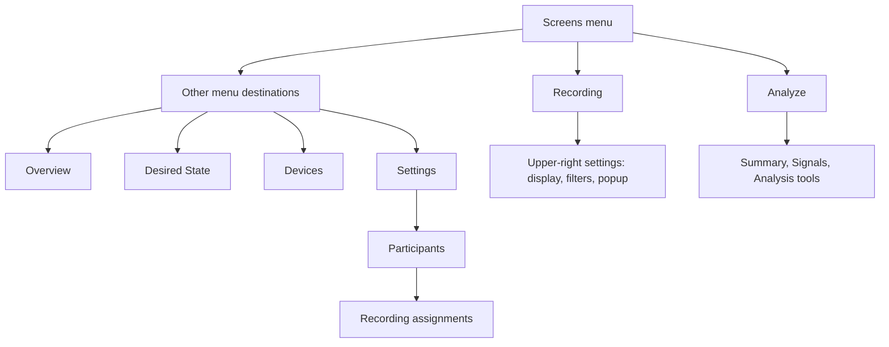

# App map

Updated 2026-10-11. This describes implemented routes and actions, not planned features. Update this file in every change that moves, adds, removes, or renames an option. Keep the overview small; add details to the action table.

## Options and ownership

| Screen / window | Actions and options | Implementation |
| --- | --- | --- |
| Overview (startup) | Choose participant; 7/30/90 day summaries; recent recordings; open Recording or Analyze; Devices; refresh. Active capture indicator remains here. | `overview_screen.dart` |
| Recording — setup | Choose participant; optional recording type (create/edit/archive, most-used first); description/notes; optional duration timer; start. NEW RECORDING returns here. | `main.dart`, `recording_types.dart`, `session_timer_widgets.dart` |
| Recording — active / stopped | Live H10 metrics, EEG trends, oxygen/pulse, posture, ECG; scrollable quick markers/optional feeling with fixed primary event/pause/stop controls; bounded time browsing; touch inspection; pause/resume/stop; mark event and optional event note; recording notes; stopped export/review; optional feedback. | `main.dart`, `processing_screen.dart`, sensor panels, `quick_marker_widgets.dart` |
| Recording — upper-right settings | One editor for visible signals, touch popup fields, acquired/saved streams, H10 metrics (including SDNN), RR screening/filtering, plot configuration, processing presets; Apply & save. Choices that affect derived processing are logged during capture. | `preferences_screen.dart`, `ProcessingEditor` |
| Desired State | Guided variant of Recording; intention/desired state setup, practice and optional state feedback. Uses the same acquisition/controller. | `CollectorScreen(guided: true)`, `state_feedback_widgets.dart` |
| Analyze — recording list | Search; participant/device/date filters; refresh; readable description or recording type, participant/date/duration/sensor summary; open recording; recoverable trash/restore. | `history_screen.dart` |
| Analyze — Summary | Recording description, notes/tags, participant snapshot, events and audited event edits, outcomes/revisions, HR/RR/RMSSD review, export, recoverable delete; technical IDs in collapsed details. Active snapshots retain write guards. | `HistoryDetailScreen`, `HistoryMetadataEditor` |
| Analyze — Signals | Saved time window/follow controls; low-rate signals and raw waveform/motion views; shared touch marker/readout. | `session_timeline_screen.dart` |
| Analyze — Analysis tools | HRV blocks/quality, EEG bands/channel/units/artifact screening, comparisons/baseline/range, raw ECG/EEG excerpts, event context, saved reviews; configurable detailed processing. | `session_review_screen.dart`, `processing_screen.dart`, `eeg_saved_screen.dart` |
| Devices | Discover/connect/disconnect/reconnect H10, O2Ring, Muse Athena; stream status, ACC/posture calibration, ECG, optical capture choices; device-specific diagnostics/raw packets. | `device_screen.dart`, `device_detail_screen.dart`, diagnostics panels |
| Settings — Participants | Search/add/edit profiles; merge linked IDs; view a participant's recordings; **Recording assignments** corrects the participant on saved recordings with an audited metadata revision. Active recordings cannot be reassigned. | `participant_tools.dart`, `recording_assignments_screen.dart` |
| Settings — Practice | Breathing pacer; inhale/exhale durations; vibration/sound; start/stop practice. | `practice_screen.dart` |
| Settings — other | Customize Live (same Recording editor); recording stream defaults; processing/plot editor and presets; recording storage diagnostics. | `settings_screen.dart` |
| Advanced tools (retained) | All session signals, History, device diagnostics, detailed processing/plots. These are shortcuts to existing screens; no second Recording settings editor. | `main.dart` |
| Windows desktop | Local folder/import/sync, recording list/filter/review, waveform time browsing and shared desktop cursor, event/notes review, export and configured backend upload/status; saved EEG comparison. | `desktop_screen.dart`, `desktop_sync.dart`, `backend_upload_screen.dart` |

## Plot contract

`plot_template.dart` owns the H10-based plot margins and grid style. Mobile H10, EEG, ECG, optical, oxygen/posture/motion time-series use this frame and the same elapsed time labels; desktop uses the same frame with two native-unit axes. Per-signal units and scale controls remain available.

`PlotInspectionScope` owns one absolute selected time for a recording; same-origin nested scopes share it. All mounted plots draw that marker when the selected time falls in their displayed interval. Newly mounted/offscreen plots inherit it. The touched plot owns the single popup; closing it clears all markers. Raw ECG/EEG excerpts follow selections outside their current excerpt; live ECG can load a bounded original-file excerpt outside its preview buffer.

Popup settings: BPM, HRV (RMSSD), SpO2, Position, Alpha, Beta, Theta, Delta, Gamma, ECG; ECG is initially off. Additional plotted field names register automatically and appear after the defaults. Saved views use saved samples and never substitute current live values. Missing/gap values stay unavailable. Waveform times use approximate host anchors; the marker does not imply synchronized devices.

Acquisition belongs to the app-owned `SessionController`; plots and navigation observe it. UI label changes do not rename the raw session schema. Participant administration lives outside Analyze. Future Analyze improvements should extend review quality and usefulness without adding capture/setup administration there.

## Validation boundary

Windows source packages use `tools/install_source_package.ps1` to select a ZIP, including renamed downloads; each package identifies its installer in `source-package.json`.

Source format/syntax and patch checks are separate from Flutter/widget/APK and physical-device validation. See `current-state.md` and `project-log.md` for the latest evidence and pending checks.

Overview recording status scrolls with content, including loading/error states. Long connection diagnostics must not consume a fixed header above the content.
